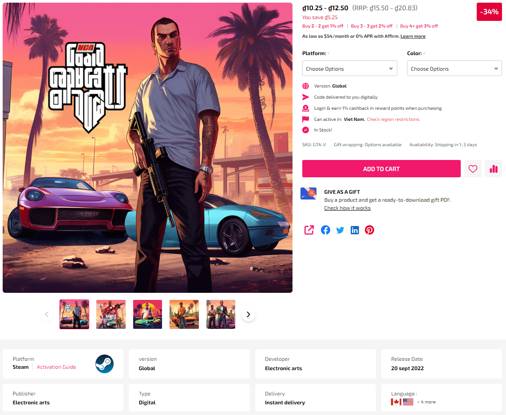
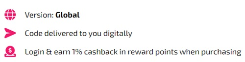
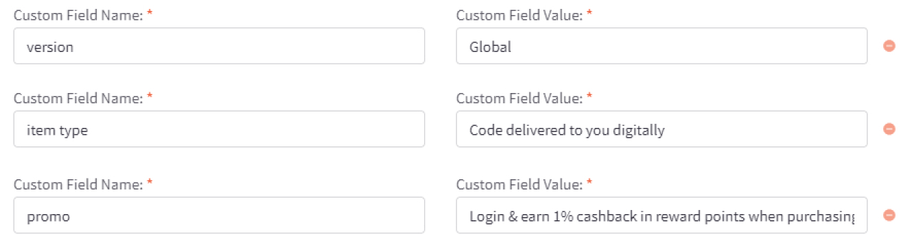
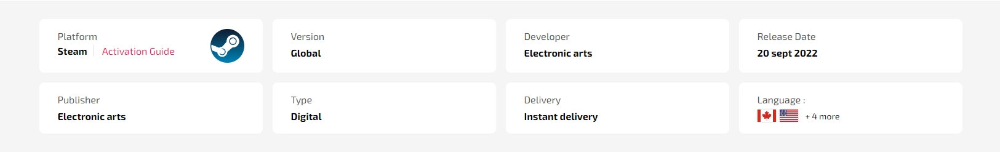

# Usage Guide

## Get Started

Thanks for using our theme!

To set up the theme exactly like our demo stores, you may need to install the our free app **[PapaThemes Widgets](https://www.bigcommerce.com/apps/papathemes-widgets/)**. This app provides additional widgets to build the content in Page Builder visually without coding skill. 

For displaying your Instagram photos on your website, you can use our free tool **[PapaThemes Instagram](https://instagram.papathemes.com/)**. We will guide you step by step later in this manual.

### Customizing Typography, Fonts and Colors

Customizing Typography, Fonts and Colors, Buttons in **Page Builder** > **Theme Styles** > **General**. There are dozens of options to help you customize your website beautifully and uniquely.

### Customizing Checkout Page's Typography and Colors

Customizing the checkout page's typography and colors in **Page Builder** > **Theme Styles** > **Optimized Checkout**

### Installing PapaThemes Widgets App

Find and install **[PapaThemes Widgets](https://www.bigcommerce.com/apps/papathemes-widgets/)** app from [BigCommerce Apps Marketplace](https://www.bigcommerce.com/apps/).

After installed, go to your admin page, on the left sidebar, click **Apps** >** My Apps**, click **Launch** button of PapaThemes Widgets app to open the app:


Then click the Install buttons in turn to install all available widgets:


Go to **Storefront** > **My Themes** > click **Customize** in dropdown menu of Kitchenary theme to open Page Builder. Select any theme style to start:


Verify the widgets installed successfully if they appear in Page Builder:


## Setting Up Cooking Style Home Page

To start customizing the theme, login to your admin panel, go to **Storefront** > **My Themes**, click **Customize** button next to theme thumbnail.

### Header


To configure the header, click on **Theme Styles** > **Header** section, here you can config the header colors, store logo position and size.

**User Navigation** allows to change colors of the icon phone, cart.

**Top Bar** section allows to change color of this top bar.

**Watch the instruction video:**

<iframe width="760" height="515" src="https://www.youtube.com/embed/Ry8ANybgdSI?si=ZIJXrTKBdDY4IXn4" title="YouTube video player" frameborder="0" allow="accelerometer; autoplay; clipboard-write; encrypted-media; gyroscope; picture-in-picture; web-share" allowfullscreen></iframe>

#### Webpage Outliner


To config outliner of webpage, click on **Theme Styles** > **Header** > **Top Bar** change color of **Background** to color of your design (exmaple: #F3AD66). Beside the background the theme also allow users to change **Text**, **Text Hover** and **Icon** color on the Top Bar.


#### Quick search

**Quick Search** allows user to change the colors of the search form.

To configure the **Quick Search**, click on **Theme Styles** > **Header**. In **Quick Search** section you can change text colors, hover, border, and background of the search field.

To change popular search keywords, type your text in **popular search keywords** field as picture below.


#### Main Navigation

**Main Navigation** allows to customize this navigation bar like changing the menu type to column, dropdown menu or mega menu; changing colors of the top menu as well as the sub-menus. There is an option "**Hide webpage links**" that allows to hide the static web page links on the main navigation.

To configure the Main navigation, click on **Theme Styles** > **Header**. In **Main navigation** section you can change:

- **Root menu item color**: text color of root menu item.

- **+ Hover**: text color on hover on the root menu item.

- **+ Background**: background color of sub menu block.

- **+ Background (Mobile)**: background color of menu on mobile device.

- **Sub menu item color**: text color of the submenu item.

- **+ Hover**: text color on hover on the submenu item.

- **+ Background**: background color of the submenu item.

- **+ Background hover**: background color on hover on the submenu item.

- **+ Border**: border-color of mega menu popup.


To config style of main navigation, click on **Theme Styles** > **Header**. In **Main navigation** select **Menu style**. The theme offer 3 option as below:

- `Mega menu`: show submenu under Mega menu style. **Mega menu** allow user insert banner and product into it


- `Dropdown`: show sub-menu item as dropdown style.


- `Column`: show sub-menu item as column style.


To create banner on Megamenu, in **Header** find and checked **Show widgets in mega menu** to show **edit menu widget** button.

Click on **edit menu widget** button to open Mega menu in design mode.


#### Hide webpage links

To hide Weboage links such as **Contact us**, **About Us**, **Shipping and return** from header, in **Themes style** > **Header** Find **Hide Webpage links** option checked to hide all the links except **Categories** link.

If you only want to hide some specific links not all the link you can do following step:

- `+ Begining` field: input the order link you want to show.
- `+ Limit` field: input number web link you want to show after begining field.

For example: if you only want show **Theme Features** and **shipping & return**:
- Begining field: 2;
- limit field:  2;

Note: the order will only count non-categories link.

Before:


Affer:


### Top Banner

Go back to **Storefront** > **My Themes** > click **Customize** button beside the theme thumbnail. You can see the top banner appears above the header. To change the colors of the top banner, go to **Theme Styles** > **General** > **Top banners** section. Here you can change the text color and the background color.

**Watch the instruction video:**

<iframe width="760" height="515" src="https://www.youtube.com/embed/yvkQCvDx3Fc?si=WJek4U1BstkN2sFU" title="YouTube video player" frameborder="0" allow="accelerometer; autoplay; clipboard-write; encrypted-media; gyroscope; picture-in-picture; web-share" allowfullscreen></iframe>


You can also create **top banner** by drag and drop **HTML widget** into corresponding position:


Enter your content inside `<p data-marquee></p>`.

```html
<p data-marquee>Get a discount with our limited time offer - Use code&nbsp;<strong>SAVE10</strong>&nbsp;for&nbsp;<strong>10%</strong>&nbsp;off your purchase!</p>
<p data-marquee>Dive into our newest collection of eco-friendly products! Let's make a difference together.</p>
<p data-marquee>Discover the beauty of handcrafted artisanal items in our latest collection. Every piece tells a story.</p>

```

### Ad Banner displays on all pages

To display the ad banner appearing on all pages on the header, drag and drop the HTML widget to the corresponding position, paste the given code below to the HTML editor, then click Save HTML button.

```html
<p style="display:flex; align-items: center">
<span style="font-size: 24px">&#127881;</span>
<span>&nbsp;<strong>Buy More, Save More!</strong> Get <strong>10%</strong> off when you purchase <strong>2+</strong> or more of our products.&nbsp;&nbsp;&nbsp;</span>
</p>
```


**Watch the instruction video:**

<iframe width="760" height="515" src="https://www.youtube.com/embed/X-0U2gh2S54?si=LuJfGRh2pjO7FSL0" title="YouTube video player" frameborder="0" allow="accelerometer; autoplay; clipboard-write; encrypted-media; gyroscope; pictre-in-picture; web-share" allowfullscreen></iframe>

### Main Carousel


Upload the carousel images in **Storefront** > **Home Page Carousel**.

Go back to **Page Builder**, in **Theme Styles** > **Home Page**, make sure **Carousel** > **Show carousel** is selected. You can change the carousel styles and colors here.

**Watch the instruction video:**

<div style="padding:56.25% 0 0 0;position:relative;"><iframe src="https://player.vimeo.com/video/796542010?h=3030ce28cf&amp;badge=0&amp;autopause=0&amp;player_id=0&amp;app_id=58479" frameborder="0" allow="autoplay; fullscreen; picture-in-picture" allowfullscreen style="position:absolute;top:0;left:0;width:100%;height:100%;" title="instr-home carousel"></iframe></div><script src="https://player.vimeo.com/api/player.js"></script>

### Product By Category


Navigate to **Theme Styles** > **Home Page** choose one of the sections and type `pbcst` to enable this block.

This section allow users to select categories, specify the number of products to be shown, and determine the number of sub-categories to display.

in **Theme styles** > **Home Page** find **Products by Category with Sorting Tabs**:

- Check the box labeled **Only load when scrolling to the viewport** to enhance site performance. The products in this block will load only when the user scrolls to this section.
- To specify the categories that should be displayed on the **Home Page**, enter the desired category IDs in the field below **Categories ID (separated by ,)**. Each ID should be separated by a comma. For example: 123,456,567.
- In the **Number of Categories** dropdown, select the desired number of categories to be displayed on the **Home Page**.
- **Default sorting** allows you to control the display of products within categories. You can choose from four options: `Newest`, `Featured`, `Best-selling`, and `Top-review`.
- Users can also adjust the number of products displayed on the Home Page by entering a number in the **Number of products** field
- Users can also specify the number of sub-categories to be displayed on the Home Page by entering a number in the **Number of subcategories** field.


### Shopping Guide


**Shopping guide** is section that loading content from **blogs page**. **Shopping guide** and **Blog** have the same content and function we advise you should only use one them.

To enable **Shopping guide**, in **Theme Styles** > **Homepage** > **Section** choose one of sections and type `shopping_guide` to enable this block.

To change color background of this section click on **Background** and select color fit to design.


To change tilte of this section, in **Hompage** find **Shopping guide & Newest Update** type your text in **Heading**.

**Shopping guide** is an upgrade version of blogs section by add quick view modal which help user quickly access information without open new pages. **Shopping guide** quick view will automatic load all **widget** that have been designed from blog page.


**Creating shopping list and other widget in Shopping Guide**

You can replace video widget with other widget you want, in this example we use video widget.

Drag & drop **Layout** widget to the corresponding position, change **Column** = `1`.


Select **Column 1**, set **Padding** = `0 0 0 0`.

Drag & drop **Video** widget into **Colum 1**. Copy the video link and paste it in the **Video URL** field.

Save the changes and preview the widget on the homepage.


Creating a widget product list on the blog page:

Drag & drop **Layout** widget to the corresponding position, change **Column** = `1`.


Select **Column 1**, set **Padding** = `0 0 0 0`.

Drag & drop **Section Heading | PapaThemes Beautify** widget into the **Layout**. Typing your text (example "Shopping List"), select `custom` in **Text style** field, set **Font size** = `20px`, **Text color** = `#000000`, **Margin** = `0 0 16 0`, **Margin (Mobile)** = `0 0 16 0`.

Drag & drop **Product List| PapaThemes Beautify** widget below **Section Heading | PapaThemes Beautify** widget. Click on the **Add product icon** and enter the product name


In the **Element** section, enable the options to display the desired product information. Click on **Edit** for the **Add to Cart** button and turn on the **Show quantity box** option.


Save the changes and check the popup on the homepage.


### Featured Brands


**Featured brand** will automatic load all brands of your store.

To enable **Featured brand**, in **Theme Styles** > **Homepage** > **Section** choose one of sections and type `featured_brands` to enable this block.

To change color background of this section click on **Background** and select color fit to design.

This section allow user change section tiltle and display/hide brands logo, in **Hompage** find **Featured brand** type your text in **Heading** and checked the **Show brand logo** to display brands logo.

### Top Categories


**Top Categories** will automatic load first level categories of your store.

To enable **Top Categories**, in **Theme Styles** > **Homepage** > **Section** choose one of sections and type `top_categories` to enable this block.

To change color background of this section click on **Background** and select color fit to design.

This section allow user change section tiltle, in **Hompage** find **Top Categories** type your text in **Heading**.

### Shop For Kitchen


Drag & drop **Layout widget** to the corresponding position, change **Column** = `1`.

Select Column 1, set **Padding** = `0 0 0 0`. To change the **Background color** to `#F9F9F9`.

Drag & drop **Section Heading | PapaThemes Beautify** widget into the **Layout**. Typing your text (example "Shop for Kitchen, Home Appliances and More..."), select custom in **Text style** field, set **Font size** = `20px`, **Font weight** = `Semi Bold`, **Text color** = `#000000`, **Padding** = `40 0 40 0`, **Padding (Mobile)** = `20 0 20 0`.

Drag & drop **Flex Banners | PapaThemes Beautify** widget below **Section Heading | PapaThemes Beautify** widget. Delete all other callouts except the first one.

Choose the `Circle` option in the **Icon** section.

For the **Width**, select the unit `%` and specify the values for different devices as follows: **Desktop** = `12.5%`, **Tablet** = `15.5%`, **Mobile** = `23%`.

In the **Padding** section, set the values for different devices as follows: **Desktop** = `0 15 30 15`, **Tablet** = `0 8 0 8`, **Mobile** = `0 8 0 8`.


Select your desired icon in the **Icon** section.

Modify the icon's **Color** to your preference.
Paste the link into the designated **Link** box.

Select `Custom` for the **Text style**. Set the **Font size** = `12px` for desktop devices. Adjust the **Font size(Mobile)** = `10px`. Customize the text content and choose your preferred **Text color**.

Duplicate Icon-1 to create more similar icons. Change the image and link of the icons just created.

### Special Products Tabs


You can configure special products tabs section settings in **Page Builder** > **Theme Styles** > **Home Page**, make sure one of the **Sections** field type `spt`.

In **New / Featured / Bestselling Tabs** section, Change **Number of products** = `5` and **Number of products load more on viewport** = `0`. You can change **Default tab** to `Featured`, `Bestselling` or `New`. **Display type** can be changed to `Carousel` or `Grid`. **Show more button**, **featured products**, **bestselling products**, **new products**, **categories** can be enabled by checked box.

### Featured Products


You can set featured products in **Products**, click the **star** icon on the same row to set the product as featured.

Go back to **Page Builder** > **Theme Styles** > **Home Page**, make sure one of the **Sections** has typed `featured_products`. In **Featured products** section, you can change the **Heading**, **Number of products** to display, Number of product per row (**Columns**), changing **Display type** to `Carousel` or `Grid`, changing the **background color**, editing the link of **View all products**.

### Grid layout banners


To create **grid layout banners** :

In **Page Builder**, drag & drop **Layout** widget to the corresponding position. Change **Column** = `1`, set **Padding** = `0 0 0 0`.

Drag and drop **Flex Banners | PapaThemes Beautify** widget into **Column 1**. Click on **Setting** > **Style for theme** select `kitchenary` Then delete all Flex Banners except the first one.


To edit **Banner 1**, change your image, set **Image width** = `1200px`, **Image height** = `600px`. If you want to display different image on mobile check on Show different image on mobile and upload your image and adjust image size.

In **Content** > set **Content Align** follow **vertical** = `bottom`, **Content padding** and **Content padding (Tablet)** = `15 20 15 20`, **Content padding (Mobile)** = `15 15 15 15`. Change **Content background color to** `#000000` and hide **Heading content**.

In **Content** > activate the **Description text**, set **Font weight** = `Normal`, **Text color** = `#FFFFFF`

In **Content** > activate the **Action button**, set **Position** = `Right`.

In **General** > **Width** panel choose **Width** = `%`, set **Value (Desktop)** and **Value (Tablet)** = `50%`, **Value (Mobile)** = `100%`.

In **General** > **Padding**, set **Desktop** = `15 15 15 15`, **Tablet** = `8 8 8 8` and **Mobile** = `8 0 8 0`.

Duplicate to 4 banners and upload images according to each banner.

### New Products


You can configure new products section settings in **Page Builder** > **Theme Styles** > **Home Page**, make sure one of the **Sections** has typed `new_products` . In **New products** section, you can change the **Heading**, **Number of products** to display, Number of product per row (**Columns**), changing **Display type** to `Carousel` or `Grid`, changing the **background color**, editing the link of **View all products**.

### Bestselling Products


Bestselling products only display when your store has some order.

You can configure bestselling products section settings in **Page Builder** > **Theme Styles** > **Home Page**, make sure one of the **Sections** has typed `popular_products`. In **Best-sellers products** section, you can change the **Heading**, **Number of products** to display, Number of product per row (**Columns**), changing **Display type** to `Carousel` or `Grid`, changing the **background color**, editing the link of **View all products**.

### Banner

Desktop : 


Mobile : 


Drag & drop **Layout widget** to the corresponding position, change **Column** = `1`, set **Padding** = `0 0 0 0`.

Drag & drop **Leaderboard Banner| PapaThemes Beautify**, set **Banner height** = `800px` and **Banner height(mobile)** = `369px`. Consider the background color of you want **Background color**.

You can customize the desktop image in the **Image** section, and also modify the images for the tablet and mobile screens in the **Image (mobile)** section. Unchecked **Display in container div**

In **Heading**, set **Heading Style** = `Custom`, **Font Weight** = `Bold`, **Font size** = `32px`, **Heading color** and **Heading color(mobile)** = `#FFFFFF`.

In **Text**, set **Font Size** = `16px`, **Font weight** = `Medium`, **Text color** and **Text color(mobile)** = `#FFFFFF`.

In **Button**, set **Button color** = `#FB9A43`

In **Advanced**, choose **style for theme** = `Kitchenary`.

### Categories Banner


Drag & drop **Layout widget** to the corresponding position, change **Column** = `1`, set **Padding** = `0 0 0 0`.

Drag & drop **Flex banners|papathemes beautify** to column 1 and delete all banner except the first one.

Insert your banner image with size `1092x135`, change **image width** = `1092`and **image height** = `135`

Set **border radius** = `4px` 

in content, disable `heading text`

### Recently Viewed Products


Recently Viewed Products will be display automatically viewed any product.

You can configure recently viewed products section settings in **Page Builder** > **Theme Styles** > **Home Page**, make sure one of the **Sections** has typed `recentviewed`. In **Recently Viewed Products** section, you can change the **Heading**, **Number of products** to display, Number of product per row (**Columns**), changing **Display type** to `Carousel` or `Grid`, changing the **background color**, editing the link of **View all products**.

### Customer Service


To enable **Customer service**, in **Theme Styles** > **Homepage** > **Section** choose one of sections and type `customer_service` to enable this block.

To change color background of this section click on Background and select color fit to design.

This section allow user change section tiltle, in **Hompage** find **Customer service** type your text in Heading.

- **Phone number**: will automatically collect number from store profile.
- **Whapsapp**: To change Whatsapp number, go to **Footer** find **+Whatsapp** and type your number in the input field.
- **Email**: To change email number, go to **Footer** find **+Email** and type your email address in the input field.


To change Background of button, go to **General** find **General colors** change **Secondary color** to your color.

To change **Text**, **Icon**, color go to **General** find **Links colors** change **Default** to your color.

### Recent Blog Posts


You can add blog posts in Storefront > Blog. Click the **+** button to add a new blog post. Make sure **Blog Visibility** is `on`.

To display the **recent blog** posts on the home page, go to **Page Builder**. In **Theme Styles** > **Home Page**, make sure one of Sections has typed `blog_recent`. Scroll down the Recent Blog section, you can configure **Heading**, **Number of posts** to display.

### Customer Reviews


Drag & drop **Layout** widget to the corresponding position, change **Column** = `1`. Select **Column 1**, set **Padding** = `0 0 0 0`.

Drag & drop **Section Heading | PapaThemes Beautify** widget into the **Layout**. Typing your text (example "Our Customer Reviews"), select `custom` in **Text style** field, set **Font size** = `20px`, **Text color** = `#000000`, **Margin** = `36 0 16 0`, **Margin (Mobile)** = `18 0 0 0`.

Drag & drop **Customer Reviews | PapaThemes Beautify** widget below **Section Heading | PapaThemes Beautify** widget. Make sure to remove all reviews except for the first one.

For each review, provide the following details:

**Title**: Enter the title of the review.

**Content**: Write the content of the review.

**Rating**: Choose the desired number of review stars.

**Author**: Specify the name of the reviewer.

To maintain consistency in the theme, select `Beautify Furniture` in the **Style for theme** option.

If you want to add more reviews, duplicate the first review as many times as needed and update the content for each review.


### Newsletter


To enable newsletter form, go to **Marketing** > **Email Marketing**, make sure **Allow Newsletter Subscriptions** is checked. Optionally select **Show Newsletter Summary** and enter the summary text as you want.

Go to Page Builder, in **Theme Styles** > **Footer** > **Newsletter** section.

Make sure **Show newsletter form** is selected. You can change the **Heading**, **background color**, **background image**, **button** and **text colors**.

**Watch the instruction video:**

<iframe width="760" height="515" src="https://www.youtube.com/embed/5HxXt7uaX5c?si=QjmxVqePqgfLxxm6" title="YouTube video player" frameborder="0" allow="accelerometer; autoplay; clipboard-write; encrypted-media; gyroscope; picture-in-picture; web-share" allowfullscreen></iframe>

### Newsletter Popup


**Newsletter Popup**use the same content and heading with **Newsletter** in footer. Please find instruction to change content in **Newsletter**.

To change delay time and show up again peropd for display **Newsletter Popup**, in **Theme styles** > **General** > **Newsletter Popup** change **Show after page loaded (sec)** for delay time to display the popup, change **Don't show up again (sec)** for the popup re-appear again.

To change image in **Newsletter popup**, simply copy and paste your Image URL to **Newsletter Popup background URL**


### Benefit

Desktop :


To create **Benefit**:

In **Page Builder**, drag & drop **Layout** widget to the corresponding position. Change **Column** = `1`, set **Padding** = `0 0 0 0`.

Drag and drop **Callout Icons | PapaThemes Beautify** widget into **Column 1**. Delete all other callouts except the first one.

Choose the `Large` option in the Icon section. 

For the **Width**, select the unit `%` and specify the values for different devices as follows: **Desktop** = `16,5%`, **Tablet** = `33,33%`, **Mobile** = `50%`.

In the **Padding** section, set the values for different devices as follows: **Desktop** = `45 5 45 5`, **Tablet** and **Mobile** = `20 5 20 5`.

Select your desired icon in the **Icon** section, then change **icon color** follow your design.

In **Show text**, **Text style** choose `Custom` then set **text color** = `#000000` and **text color (hover)** = `#FF7700 `.

Enable **Show second text**, **Text style** choose `Custom` then set **text color** = `#000000` and **text color (hover)** = `#FF7700`

Duplicate Icon-1 to 6 icon. Change the image and link for each duplicated icon.

### Footer


In **Page Builder** > **Theme Styles** > **Footer**, you can configure the newsletter form appearance in **Newsletter** section, configure the footer link colors in **Main Footer** section, displaying store logo, contact info, store address,... **Show pages** allows to limit number of web page links to display. **Show categories** allows to limit number of category links to display. Similarly for **Show brands** option.

**Payment Icons** allows to select which payment icons to display.

**Copyright** allows to configure the copyright text.

**Watch the instruction video:**

<iframe width="760" height="515" src="https://www.youtube.com/embed/A481Na0Ec0Y?si=l12B8xW6ZszZjqp7" title="YouTube video player" frameborder="0" allow="accelerometer; autoplay; clipboard-write; encrypted-media; gyroscope; picture-in-picture; web-share" allowfullscreen></iframe>

### Footer Map

**Create map using widget**


Drag and drop the **Layout widget** to the desired position. Set the **Column** = `1`.

Select Column 1 and set the **Padding** = `0 0 0 0`.

Drag and drop the **HTML** widget into the Layout section.

Obtain the embed map code by following these instructions:

Go to https://www.google.com/maps and enter the desired location. On the left side of the screen, select **Share** and then choose **Embed a map**.
Copy the HTML code provided.


Paste the map code into the HTML editor. Edit the **width** and **height** = `100%`, and click the Save HTML button.


**To display the map using an API key:**

Configure Footer map in **Page Builder** > **Theme Styles** > **Footer** > **Main Footer**.


Enable the **Show Google map** option.

Fill in your **Google Maps API key**. If you don't have an API key, please see instruction at the link: `https://developers.google.com/maps/documentation/javascript/get-api-key`

Enter the **Latitude, Longitude, and Zoom level** for the map. Separate the values with commas and ensure they are contiguous.

Example: `10.795005889833666, 106.72182056991105, 15`.

To obtain the latitude and longitude values, follow these steps:

Go to `https://www.google.com/maps` and enter the desired location.
Right-click on the marker icon on the map and copy the longitude and latitude values.


### Instagram photos

To display your Instagram photos, open <https://instagram.papathemes.com/> Follow the instruction on this page to [Connect your Facebook Page with your Instagram account](https://www.facebook.com/business/help/898752960195806). Then click **Login With Facebook** button and follow the further steps to authorize access permission. Click **Show Embedding Code** button to generate the code embedding to your web store. Choose **Preset** = `Carousel` and select **LazyLoad**.

Copy all the code appear in Step 1 & Step 2. For example:

```html
<script>!function(){var a=document.createElement("script");a.defer=!0,a.src="https://papathemes.s3.amazonaws.com/instagramapp/assets/js/embed-1.0.1.js",a.onload=function(){PapathemesInstagramApp.init({account_id:"****************",element_id:"papainstagram-render",limit:"20",preset:"grid",lazyload:"false"})},document.body.appendChild(a)}();</script>

<div id="papainstagram-render"></div>
```

Go back to your store Page Builder. Drag & drop the HTML widget to the corresponding position. Paste the generated code above to the HTML editor, and click **Save HTML** button. Your Instagram photos should display like our demo store.

Please note that the app only updates your latest uploaded photos every 6 hours.

To create the title, drag & drop the **Section Heading** widget to above the Instagram photos. Set **Padding** = `40 0 40 0` and **Padding (Mobile)** = `20 0 20 0`.

**Watch the instruction video:**

<div style="padding:56.25% 0 0 0;position:relative;"><iframe src="https://player.vimeo.com/video/795504772?h=06cb1784a7&amp;badge=0&amp;autopause=0&amp;player_id=0&amp;app_id=58479" frameborder="0" allow="autoplay; fullscreen; picture-in-picture" allowfullscreen style="position:absolute;top:0;left:0;width:100%;height:100%;" title="instr-instagram"></iframe></div><script src="https://player.vimeo.com/api/player.js"></script>

### Display Custom Footer Links

In **Page builder** > **Custom Widget** find **Footer links | PapaThemes Beautify** widget then drag and drop the widget to corresponding position in **Footer**.

Select the **Column 1** and change **padding** to `0 0 0 0`.

In **design** you can type your link content and click on the **insert/edit link** button as picture below:


In the popup window, copy your web link to `URL`. On the **Open links..** field you can select how your link could be open in **New Window** or **Current Window**
 
 

## Setting Up Pharmacy Style Home Page

### General

You can read these common instructions in **Setting Up Cooking Style Home Page** chapter:

- [Header](#header)
- [Top Banner](#top-banner)
- [Ad Banner displays on all pages](#ad-banner-displays-on-all-pages)
- [Main carousel](#main-carousel)
- [Shopping Guide](#shopping-guide)
- [Top Categories](#top-categories)
- [Featured brands](#featured-brands)
- [Bestselling products](#bestselling-products)
- [Banner](#banner)
- [Featured products](#featured-products)
- [New products](#new-products)
- [Recently viewed products](#recently-viewed-products)
- [Customer service](#customer-service)
- [Recent blog posts](#recent-blog-posts)
- [Customer reviews](#customer-reviews)
- [Newsletter](#newsletter)
- [Footer](#footer)
- [Footer Map](#footer-map)
- [Display custom footer links](#display-custom-footer-links)
### Shop for All Your Health & Wellness Needs
Desktop :


Mobile :


Drag & drop **Layout widget** to the corresponding position, change **Column** = `1`, set **Padding** = `0 0 0 0`.

Drag & drop **Section Heading | PapaThemes Beautify** widget into the **Layout**. Typing your text (example "Shop for All Your Health & Wellness Needs"), select `custom` in **Text style** field, set **Font size** = `20px`, **Font size(Mobile)** = `18px`, **Font weight** = `Extra Bold`, **Text color** = `#0F49A0`, **Padding** = `10 0 40 0` and **Padding (Mobile)** = `18 0 18 0`.

Drag & drop **Callout Icons | PapaThemes Beautify** widget below **Section Heading | PapaThemes Beautify** widget. Delete all other callouts except the first one.

Choose the `Circle` option in the **Icon** section.

For the **Width**, select the unit `%` and specify the values for different devices as follows: **Desktop** = `12.5%`, **Tablet** = `15.5%` and **Mobile** = `23%`.

In the **Padding** section, set the values for different devices as follows: **Desktop** = `0 15 30 15`, **Tablet** and **Mobile** = `0 8 0 8`.


Select **Icon** = `Choose Image`, change the image to suit your needs in the **Icon Image**. Paste the link into the designated **Link** box.

Select `Custom` for the **Text style**. Set the **Font size** = `12px` for desktop devices. Adjust the **Font size(Mobile)** = `10px`. Customize the text content and choose your preferred **Text color**.

Duplicate Icon-1 to create more similar icons. Change the image and link of the icons just created.
### Four Banner

Desktop :


To create **Four Banner** :

In **Page Builder**, drag & drop **Layout** widget to the corresponding position. Change **Column** = `1`, set **Padding** = `0 0 0 0`.

Drag and drop **Flex Banners | PapaThemes Beautify** widget into **Column 1**.

To edit **Banner 1**, change your image, set **Image width** = `1800`, **Image height** = `900`, **Border radius** = `0px`.

In **Content** > **Content padding** = `15 20 15 20` for all values, you can choose the custom background color for the **Content background** as per your preference.

In **Content** > **Heading text**, set **Text style** = `Custom`, **font weight** = `Light`, **font size** = `16px` and **font size(mobile)** = `14px`, **Text color** and **Text color hover** = `#0F49A0`.

In **Content** > activate the **Action button**, set **Position** = `Right`.

In **General**, choose **Width** = `%`, set **Value (Desktop)** and **Value (Tablet)** = `50%`, **Value (Mobile)** = `100%`. Set **Padding** for **Desktop** and **Tablet** =` 0 15 30 15`, **Mobile** = `0 0 15 0`.

In **Settings** > **General**, set **Style for theme** = `Kitchenary`, unchecked `Display content overlaying banner on mobile`.

Duplicate **Banner 1** to 4 banners.

### Three Banners

Desktop : 


To create **Three Banners** :

In **Page Builder**, drag & drop **Layout** widget to the corresponding position. Change **Column** = `1`, set **Padding** = `0 0 0 0`.

Drag and drop **Flex Banners | PapaThemes Beautify** widget.

To edit **Banner 1**, change your image, set **Image width** = `1170`, **Image height** = `781`, **Border radius** = `4px`.

In **Content** > **Content Padding** set `15 0 0 0` for all values.

In **Content** > **Heading text**, set **Text style** = `Custom`, **font weight** = `Bold`, **font size** and **font size(mobile)** = `16px`, **Text color** = `#0F49A0`.

In **Content** > activate the **Description text**, set **Font weight** = `Light`, **Font size** and **Font size (Mobile)** = `16px`, **Text color** and **Text color (Mobile)** = `#000000`, **Text color hover** and **Text color hover (Mobile)** = `#0F49A0`.

In **General**, choose **Width** = `%`, set **Value (Desktop)** and **Value (Tablet)** = `33,33333%`, **Value (Mobile)** = `100%`. Set **Padding** for **Desktop** and **Tablet** =` 0 15 0 15`, **Mobile** = `0 0 30 0`.

In **Settings** > **General**, set **Style for theme** = `Kansha Sport`, unchecked `Display content overlaying banner on mobile`.

Duplicate **Banner 1** to 3 banners.

## Setting Up Fashion Style Home Page

### General 

You can read these common instructions in **Setting Up Cooking Style Home Page** and **Setting Up Pharmacy Style Home Page** chapter:

- [Header](#header)
- [Top Banner](#top-banner)
- [Ad Banner displays on all pages](#ad-banner-displays-on-all-pages)
- [Main carousel](#main-carousel)
- [Shopping Guide](#shopping-guide)
- [Top Categories](#top-categories)
- [Featured brands](#featured-brands)
- [Banner](#banner)
- [Bestselling products](#bestselling-products)
- [Four Banner](#four-banner)
- [Featured products](#featured-products)
- [New products](#new-products)
- [Three Banners](#three-banners)
- [Recently viewed products](#recently-viewed-products)
- [Customer service](#customer-service)
- [Recent blog posts](#recent-blog-posts)
- [Customer reviews](#customer-reviews)
- [Newsletter](#newsletter)
- [Footer](#footer)
- [Footer Map](#footer-map)
- [Display custom footer links](#display-custom-footer-links)

### Shop for All Your Health & Wellness Needs

Desktop : 


Mobile : 


Drag & drop **Layout widget** to the corresponding position, change **Column** = `1`, set **Padding** = `0 0 0 0`.

Drag & drop **Section Heading | PapaThemes Beautify** widget into the **Layout**. Typing your text (example "Shop for All Your Health & Wellness Needs"), **Padding** = `40 0 25 0` and **Padding (Mobile)** = `30 0 20 0`.

Drag & drop **Flex Banners | PapaThemes Beautify** widget below **Section Heading | PapaThemes Beautify** widget. Delete all other callouts except the first one.

To edit **Banner 1**, change your image, set **Image width** = `250px`, **Image height** = `250px`. **Image alt text** refers to modifying the caption of an image according to your preferences. **Border radius** = `8px`

For the **Width**, select the unit `%` and specify the values for different devices as follows: **Desktop** = `12.5%`, **Tablet** = `25%` and **Mobile** = `30%`.

In the **Padding** section, set the values for different devices as follows: **Desktop** = `15 15 15 15`, **Tablet** and **Mobile** = `8 8 8 8`.

In **Settings** > **General** :

Choose **Padding**, set value **Desktop** = `0 0 25 0` and **Tablet and Mobile** = `0 0 15 0` , checked **Display content overlaying banner on mobile**.

Choose **Row wrap**, checked **Row no wrap on table** and **Row no wrap on mobile**.

Duplicate **Banner 1** to create more similar icons. Change the image and link of the icons just created.


Select **Icon** = `Choose Image`, change the image to suit your needs in the **Icon Image**. Paste the link into the designated **Link** box.

Select `Custom` for the **Text style**. Set the **Font size** = `12px` for desktop devices. Adjust the **Font size(Mobile)** = `10px`. Customize the text content and choose your preferred **Text color**.

Duplicate Icon-1 to create more similar icons. Change the image and link of the icons just created.

## Setting Up Game Style Home Page

### General

You can read these common instructions in **Setting Up Cooking Style Home Page**, **Setting Up Pharmacy Style Home Page** and **Setting Up Fashion Style Home Page** chapter:

- [Header](#header)
- [Top Banner](#top-banner)
- [Ad Banner displays on all pages](#ad-banner-displays-on-all-pages)
- [Main carousel](#main-carousel)
- [Shopping Guide](#shopping-guide)
- [Top Categories](#top-categories)
- [Featured brands](#featured-brands)
- [Banner](#banner)
- [Bestselling products](#bestselling-products)
- [Featured products](#featured-products)
- [New products](#new-products)
- [Three Banners](#three-banners)
- [Recently viewed products](#recently-viewed-products)
- [Customer service](#customer-service)
- [Customer reviews](#customer-reviews)
- [Newsletter](#newsletter)
- [Footer](#footer)
- [Footer Map](#footer-map)
- [Display custom footer links](#display-custom-footer-links)

### Browse Our Gaming Selections

Desktop :


Mobile :


Drag & drop **Layout widget** to the corresponding position, change **Column** = `1`, set **Padding** = `0 0 0 0`.

Drag & drop **Section Heading | PapaThemes Beautify** widget into the **Layout**. Typing your text (example "Browse Our Gaming Selections"), **Padding** = `40 0 30 0` and **Padding (Mobile)** = `16 0 18 0`.

Drag & drop **Flex Banners | PapaThemes Beautify** widget below **Section Heading | PapaThemes Beautify** widget. Delete all other callouts except the first one.

To edit **Banner 1**, change your image, set **Image width** = `100px`, **Image height** = `100px`. **Image alt text** refers to modifying the caption of an image according to your preferences. **Border radius** = `50px`.

In **Content** > set **Content Align** = `Center` follow **vertical** = `Bottom`.

In **Content** > **Heading text** set **Text style** = `Custom`, **Font Weight** = `Semi Bold`, **Font size** and **Font size(Mobile)** = `12px`, **Text color** and **Text color (Mobile)** = `#000000`, **Text color hover** and **Text color hover (Mobile)** = `#F2186B`

For the **Width**, select the unit `%` and specify the values for different devices as follows: **Desktop** = `12.5%`, **Tablet** = `20%` and **Mobile** = `30%`.

In the **Padding** section, set the values for different devices as follows: **Desktop** = `10 15 10 15`, **Tablet** and **Mobile** = `0 8 0 8`.

In **Settings** > **General** :

Choose **Row wrap**, checked **Row no wrap on table** and **Row no wrap on mobile**.

Duplicate **Banner 1** to create more similar icons. Change the image and link of the icons just created.

### Special game information display



#### Setup game version in product detail




To add custom fields, go to the **Product Editor**. Find **Custom Fields**, created new custom field. These special custom fields need to be name correctly to be displayed.

The custom fields with specified **Custom Fields Name** are:

`version`
`item type`
`promo`

For example:



#### Setup Region/Popup restriction


The **Custom Fields Name** `region`, the **Custom Fields Value** should be in the format of Country Codes, written as (Country Codes|Country Codes...).

For example: `(VN|US|BZ|CN)`.


You can create more than one `region` custom field and add additional Country Codes values.


Note: you only need two or more custom fields `region` when the first **custom field value** have reach word limit.

#### Setup product summary



To add custom fields, go to the **Product Editor**. Find **Custom Fields**, created new custom field. These special custom fields need to be name correctly to be displayed.

The custom fields with specified **Custom Fields Name** are:

`Developer`
`Release Date`
`Publisher`
`Type`
`Delivery`

For example:


#### Setup - Platform


For the **Platform** section, it is constructed from 3 **Custom Fields Name**: `platform`, `activation label`, `activation link`.

The `platform` corresponds to the name of the games platform. The **Logo** of the platform will display correctly when you set **Custom Fields Value** according to the configuration names specified below:

`battle.net`
`ea`
`epic games`
`gog.com`
`green gift`
`nintendo`
`origin`
`pc`
`play station`
`rock star`
`steam`
`ubisoft connect`
`windows`
`xbox-live`
`other`

The `activation label` in the illustration above is **Activation Guide**, and the `activation link` is the browser path when clicked on the `activation label`.

For example:


#### Setup - Language


The **Custom Fields Name** 'language', the **Custom Fields Value** should be in the format of Country Codes, written as (Country Codes|Country Codes...).

For example: `(US|KR|BR)`.

You can create more than one = `language` custom field and add additional Country Codes values.


Note: you only need two or more custom fields `language` when the first custom field value have reach word limit.

## Customizing Products Display

### Product Card


Configuring product cards in **Page Builder** > **Theme Styles** > **Products** > **Product cards**.

- **Alignment**: Specifying content alignment `left` or `center`.
- **Product title color**: Specifying the product name's color.
- + **Hover**: Specifying color when hover or focus.
- **Button text color**: Specifying the button text color.
- + **Background**: Specifying the button background color.
- + **Border**: Specifying the button border color.
- **Show second image on hover**: Displaying the second image when hover the product card.
- **Show border**: toggle displaying the product card border.
- **Show swatch/rectangle options**: Allows to display with swatch/rectangle type product option on every product card. It's helpful to display different product variants like colors or sizes.
- **Swatch sizes**: Specifying the swatch color/image size.
- **Badge position**: also to configure the sale badge position to `Top Left` or `Below image`.

### Displaying product price ranges

By default product price ranges is enabled. To turn off, Go to **Page Builder** > **Theme Styles** > **Products** > uncheck **Price ranges** checkbox.

**Show retail price**: Toggle displaying the product retail prices.


### Hiding prices for non logged in customers

To turn on this feature, go to **Page Builder** > **Theme Styles** > **Products** > tick **Restrict Purchase to Login** checkbox.


### Redirecting to cart page after product added to cart

By default the cart popup is displayed, if you want to take customer to the cart page instead, go to **Page Builder** > **Theme Styles** > **Products** > tick **Redirect to cart page after add to cart** checkbox.

### Showing/Hiding Quick-View button

By default quick-view buttons appear on all product cards. To hide it, go to **Page Builder** > **Theme Styles** > **Products** > un-tick **Show Quickview** checkbox.

### Showing/Hiding the quantity box on PDP

By default the quantity box shows up, to hide it, go to **Page Builder** > **Theme Styles** > **Products** > un-tick **Show quantity selection on product pages** checkbox.

### Customizing the popup displayed after product added to cart

In **Page Builder** > **Theme Styles** > **Products** > **Popup after added to cart**:

- `Default`: Displaying the large popup.
- `Mini`: Displaying a smaller popup that has auto close.
- `Cart Preview`: Displaying the whole shopping cart popup on the right side.
- `Hide`: Not show any popup.

Mini added to cart popup:


### Displaying Recently Viewed Products

Recently viewed products only display for logged-in customers.

To enable it, go to **Page Builder** > **Theme Styles** > **Products** > **Show recently viewed** select number of products to display.


### Customizing Price Labels

You can customize sale price label, before sale price label, retail price label or regular price label in 
**Page Builder** > **Theme Styles** > **Products** > **Price Labels**


### Displaying product weight, dimensions on PDP

Go to **Page Builder** > **Theme Styles** > **Products** > **Product Page**.

- Tick **Show product weight** checkbox.
- Tick **Show product dimensions** checkbox.

### Display sale badge / in-stock badge on PDP

Go to **Page Builder** > **Theme Styles** > **Products** > **Product Page**.

- Tick **Show sale badge** checkbox.
- Tick **Show in-stock badge** checkbox.

### Displaying Image gallery 

#### Image Gallery Position

In **Page Builder** > **Theme Styles** > **Products** > **Product Page**, In **Image gallery position** , select `Left` or `Right` to change Image gallery position .

- `Right`


#### Displaying sub-image as a slider

In **Page Builder** > **Theme Styles** > **Products** > **Product Page**, **Enable thumbnail carousel** section, you can change display thumbnail images to slider or grid.

- `1 row`: Sub-images are displayed in the slider on 1 row.

- `2 rows`: Sub-images are displayed in the slider on 2 row.

- `Hide`: All sub-images are displayed as grid.


#### Displaying product image thumbnails vertically

In **Page Builder** > **Theme Styles** > **Products** > **Product Page**, checked **Show image thumbnails vertically** to display product thumbnails vertically, otherwise it's displayed horizontally.

Checked **Show image thumbnails vertically**:


### Displaying product bulk pricing inline in table

Instead of displaying bulk pricing in a popup modal, you can display it inline by going to **Page Builder** > **Theme Styles** > **Products** > **Product Page**, tick **Show bulk price as table**.


### Displaying sticky Add to Cart button on PDP on mobile

In **Page Builder** > **Theme Styles** > **Products** > **Product Page**, tick **
Show sticky Add to Cart on mobile**.


### Displaying product custom fields in a separated tab

In **Page Builder** > **Theme Styles** > **Products** > **Product Page**:

- Tick **Show custom fields in tab** checkbox.
- Enter the tab title in the next **Tab title** box.


### Custom tabs


To add the **custom tabs** in product pages, edit your product description, click on **HTML button** to open HTML Source Editor:


Use the editor at the **[link](https://bc-supermarket-docs.papathemes.com/customization/product-page#custom-tabs)** to generate HTML for your **custom tabs**. Click Export HTML button, copy & paste the generated HTML at the end of HTML Source Editor.

### Displaying Delivery & Returns tab

In **Page Builder** > **Theme Styles** > **Products** > **Product Page**:

- Tick **Show Delivery & Returns tab** checkbox.
- Enter the tab title in the next **Tab title** box.

You can add specific content or global content using BC widgets:


### Numbers of products, reviews, thumbnails

In **Page Builder** > **Theme Styles** > **Products** > **Product Page**:

- **Number of Product Reviews**: Specifying number of product reviews displayed.
- **Number of Related Products**: Specifying number of related products displayed.
- **Number of Customers Also Viewed Products**: Specifying number of customer also viewed products displayed.
- **Number of visible thumbnails**: Specifying number of images displayed in the product thumbnails slider.


### Displaying Swatch Options in the dropdown select box

In **Page Builder** > **Theme Styles** > **Products** > **Swatch display type**:

- `Default` (Square): Displaying the regular swatches by default.
- `Dropdown`: Displaying swatches in the dropdown select box.
- `Dropdown + Square`: Displaying swatches in the dropdown select box in addition to regular swatches.


### Displaying Frequently Bought Together Products


Enabling this feature in **Page Builder** > **Theme Styles** > **Products** > **Frequently Bought Together**, Select **Position** to display it.

- **Load products from**: Specifing products to display here.
  - `Custom fields __alsobought`: Specifying the relevant products in product custom fields with name `__alsobought` and value is the relevant product ID. For example:
  
  - `Related products`: Pulling from the related products.
  - `Similar by biews`: Pulling from customer also viewed products.
- **Auto select all items**: Auto select or unselect all frequently bought together products.
- **Thumbnail size**: Specifying the thumbnail image size.
### Configuring swatch dimension

In **Page Builder** > **Theme Styles** > **Products** > **Swatch display type** > Set **Swatch size**.


### Sale badge, Condition badge and custom text badges


Displaying the sale badge in **Page Builder** > **Theme Styles** > **Products** > **Product sale badges**, tick **Show sale badges**.

- **Label**: Specifying the badge text.
- **Text color**: Specifying the badge text color.
- **Background color**: Specifying the badge background color

Displaying the condition badge in **Condition badges**, tick **Show condition badges**.

Displaying the condition badge in **Custom badges**, tick **Enable custom badge from '__badge' custom field**. Edit product, add custom field with name `__badge` and value is the badge text.

- **Text color**: Specifying the text color of the custom badge.
- **Background color**: Specifying the background color of the custom badge.

### Configuring image sizes


In **Page Builder** > **Theme Styles** > **Products** > **Image Sizes**:

- Main product images: Specifying the main product image size displayed on PDP.
- Thumbnail image: Specifying the product thumbnail size.
- Zoomed image: Specifying the zoomed image size.
- Image in gallery view: Specifying product card image size.

### Shipping countdown


To enable shipping countdown, **Theme styles** > **Product page**  find **shipping countdown** field and input your cut off time. Find and copied your timezone from wikipedia `https://en.wikipedia.org/wiki/List_of_tz_database_time_zones` to **timezone** field.

Note: The time before cut off the message will show **shipping today** after cut off the message will show **shipping tomorrow**

### Flash sales


To create flash sales bar for each product, in **product** select the product that you want to add flash sale bar. 

Find customer fields, click on add **Add Custom Field**. Copy `__countdown_label` and paste into **Custom Field Name**. In **Custom Field Value**, type your content following format: `<your banner name>|<end in>` (example: FLASH SALES|ENDS IN). 

Create another custom field, Copy `__countdown_date` and paste into **Custom Field Name**. In **Custom Field Value**, enter your cut off time following the format: `<yyyy>-<mm>-<dd> <hh>:<mm>:<ss><timezone>` (example: 2023-03-15 17:00:00-7).

Note:

- `<yyyy>-<mm>-<dd>` is optional. If the date is not entered, the banner will repeat automatically right after pass cut off time.
  
- `<hh>:<mm>:<ss>` is 24 hour format.
  
- `<timezone>` only input `+ or -` and `number` example: `+7`. if timezone are not entered, the countdown time will be different in different countries.
### Brand logo in product detail


To display **Brand logo** in product detail, in **Page Builder** > **Products** > **Product Page** find and check **Show brand image** option.


### Ask question

In **Page Builder** > **Theme Styles** > **Products** > **Product Page** find **Ask question (contact page URL)** and enter `/contact-us/` to display **Ask Questions?**.


### Instruction & size guide


To create additional information link:

In **Storefront** > **Web Pages**, click on the **Create a Web Page** button to create new webpage.

In **Web Page Details**, enter your page name in **Page Name** field, **Page URL** will be automatically generated. In **Page content** field enter your content.

Uncheck **Navigation Menu** options.

In **Advanced Options** set **Sort Order** = `2`.

To display the additional information link in the product detail page:

In **Products**, select the product you want to display the link. Find **Custom Fields**, created new custom field. Set **Custom Fields Name** = `__guide_popup` and **Custom Fields Value** = `<your page name>|<Page URL>` (example: `Instruction|/instruction/`) then save.

### Below add to cart banner

To create **Below add to cart banner**, in **Page builder** drag and drop **Layout widget** to corresponding position.

Select **Column 1**, set **Padding** = `0 0 0 0`.

Drag and drop **Callout icon | PapaThemes Beautify widget** into column 1, delete all icons except callout icon 1.

In **Styles** select `Left`, set **Padding** for all desktop, mobile and table = `0`.

In **Icon** change to `Choose Image`, in **Icon image** select your desire image.

To input your text into the widget, simply type it into the text field located in the design window.


### Video image product detail page

In **Page Builder** > **Theme Styles** > **Products** > **Product Page** find **Show videos** select `tab` or `image gallery` to change display video position.

Videos displayed in **tab** options:


Videos displayed in **image gallery** option:


## Customizing Category Pages

Configuring the category pages in **Page Builder** > **Theme Styles** > **Products** > **Category Page**.

### Category Layout Type

Theme supports displaying category Page layout in `Full width` mode or `Left sidebar` mode. In **Layout**, select the particular display mode for default display.

- **Layout** = `Full width`


- **Layout** = `Left sidebar`
 


### Products Display Type

Theme supports displaying products in grid mode (2, 3, 4 or 6 products per row), in list mode or bulk order mode. In **Products display type**, select the particular display mode for default display.

- **Display type** on the right allow your customers to change product category display by themselves.


**Grid 5 columns:**


**List mode:**


### Display Bulk Order layout

To display this bulk order layout, select **Products display type** = `Bulk order`.


### Displaying Shop by Brand

- **Shop by Brand**: Specifying number of popular brands to display.


### Displaying Price Slider

- **Shop by Price**:
  - `Slider`: Displaying the price slider.
  - `List`: Displaying price list.
  - `Hide`.


### Infinite Products Loading

This feature allows you to choose the method of loading more products in the current catalog.


**Infinite Products Loading**:

  - `On scroll`: Products will automatic loadout when scrolling down.

  - `Load more button`: Click on the **Load more button** to continue loading more products.

  - `Off`: Show **page numbers** and **arrow** button as original. Click on button to see more products.

### Display contextual search

This feature allows searching products within the current category and the current selected filter.


Select **Show quick search in category** = `Show` to enable it.

- **+ Show results in descendent categories**: if selected, it also displays results in the descendent categories.

### Display subcategory image thumbnails

This feature allow displaying subcategory thumbnails before products.

Select **Show subcategory thumbnails** to enable it.


### Common Settings

- **Number of products per page**: Specifying number of products to display per page.
- **Show category image**: Displaying the category image or not.
- **Show category description on AMP page**: Displaying category description on AMP category page or not. If the category content contains images, the AMP page could be invalid. It's recommended to turn off this option.

## Customizing Brand Page & Search Page

Configuring the brand page in **Page Builder** > **Theme Styles** > **Products** > **Brand Page**.

- **Number of brands per page**: Specifying number of brands to display per page.
- **Number of products per page**: Specifying number of products to display per page.
- **Brand image in gallery view**: Specifying the brand card image size.
- **Brand image in brand page**: Specifying the large image size displayed on the brand page.

Configuring the search results page in **Page Builder** > **Theme Styles** > **Products** > **Search results**.

- **Number of products per page**: Specifying number of products to display on the search results page.

### Displaying brand quick-view introduction


In **Marketing** > **Marketing Banner**, click **Create a Banner** button. 

- Enter the brand introduction content to **Banner Content**.
- Select **Show on Page** = `For a Specific Brand` and select the corresponding brand.
- Select **Location** = `Bottom of Page`.
- Then click **Save** button to finish.

Watch the instruction video:

<div style="padding:56.25% 0 0 0;position:relative;"><iframe src="https://player.vimeo.com/video/796915050?h=fa4bc20f8c&amp;badge=0&amp;autopause=0&amp;player_id=0&amp;app_id=58479" frameborder="0" allow="autoplay; fullscreen; picture-in-picture" allowfullscreen style="position:absolute;top:0;left:0;width:100%;height:100%;" title="Instr-Brand description"></iframe></div><script src="https://player.vimeo.com/api/player.js"></script>

## Customizing Cart page

### Display free shipping message in cart page.

Not qualify message


Qualify message


In **Marketing** > **Promotion** click on **create** and select **With legacy editor**

In **Promotion detail** name your promotion 

In **promotion type** select `Orders totaling more than X amount get free shipping to specific shipping zones` at the field **spend at least** type your amount


In **Promotion option** type your message at **Congratulations Banner Message** to display for cart have qualified and type your message for cart have not qualify at **Upsell Banner Message** with format `[your text] %%condition.remaining%% [your text]` then click save


